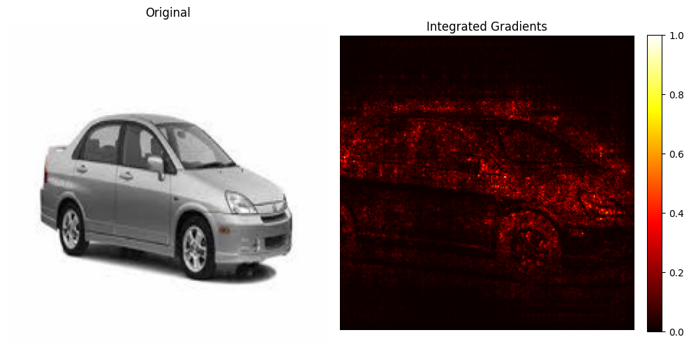
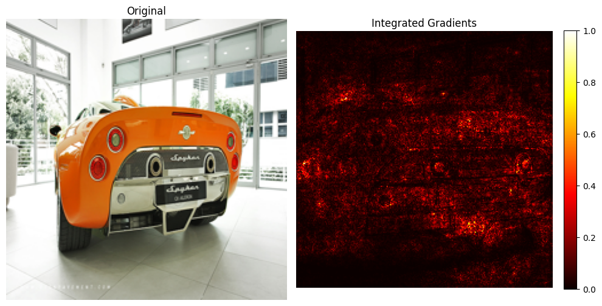
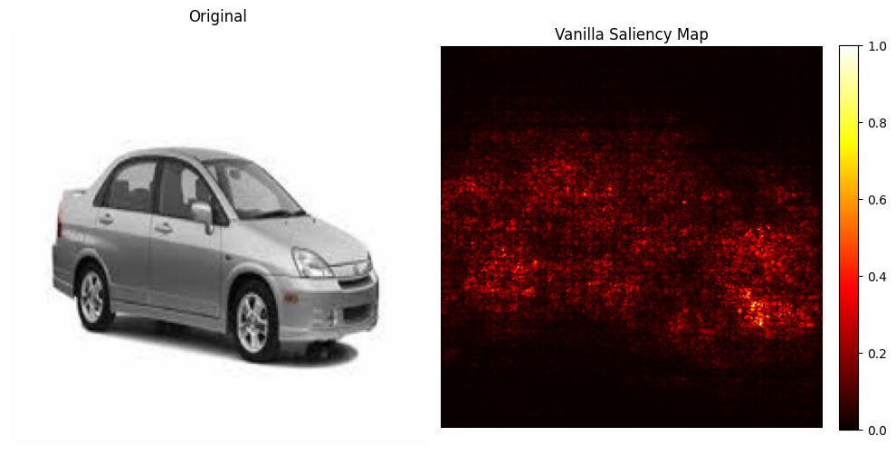
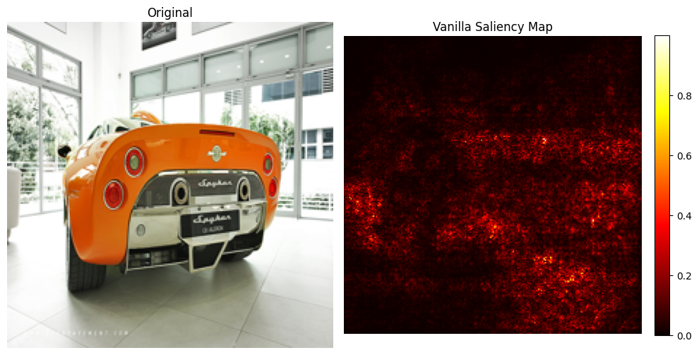
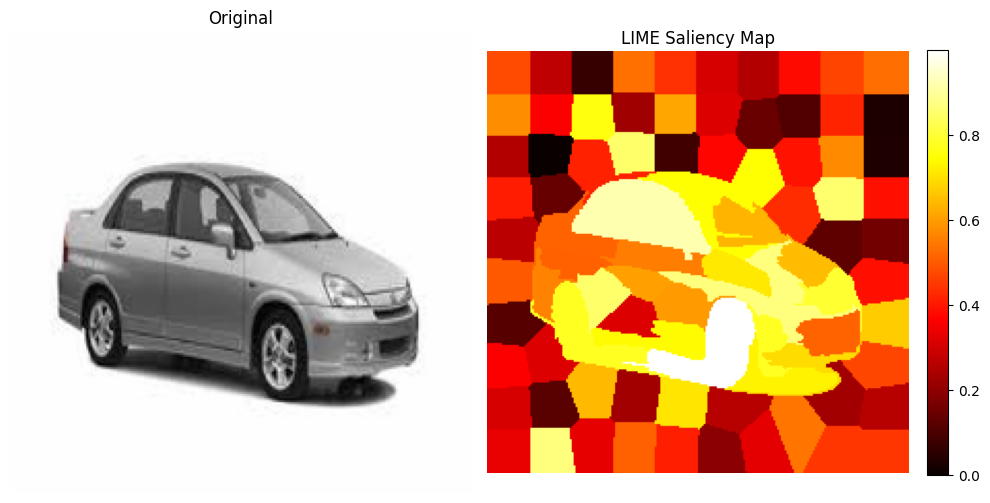
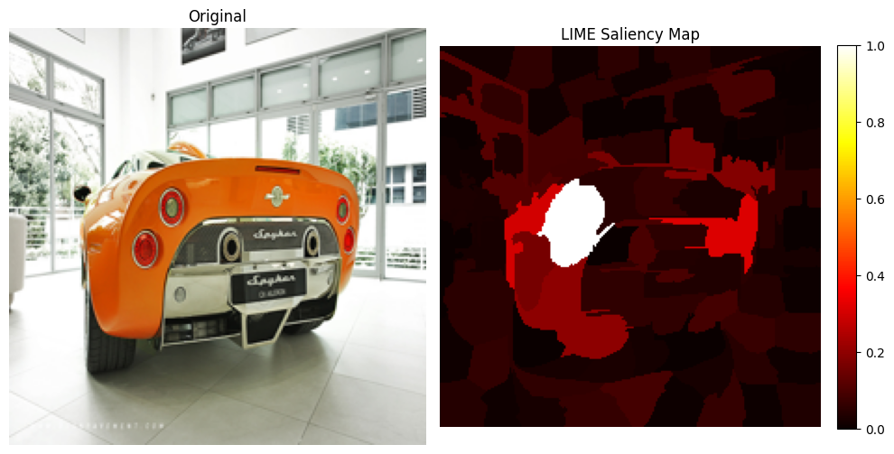

# Stanford Cars Classification

This repository contains a PyTorch workflow for training and evaluating a ResNet50 model on the Stanford Cars dataset. It includes notebook-based exploration, training code, dataset annotations, and saved model weights for inference.

## What's Inside

- `exploreData.ipynb` for quick dataset inspection and visualization.
- `train_stanford_cars.ipynb` and `train_stanford_cars.py` for model training.
- `infer.ipynb` for loading the trained checkpoint, running single-image inference, and generating saliency explanations.
- `outputs/` with the trained checkpoint, including `best_resnet50_stanford_cars.pt`.

## Inference Workflow

The inference notebook loads the ResNet50 checkpoint, applies the same ImageNet-style preprocessing used during training, and predicts a class for a sample Stanford Cars image. It also includes saliency-based explanations to help interpret what the model focuses on when making a prediction.

Key steps in `infer.ipynb`:

1. Load the model checkpoint from `outputs/best_resnet50_stanford_cars.pt`.
2. Read the Stanford Cars class metadata from `archive/cars_meta.mat`.
3. Preprocess a test image with resize, center crop, tensor conversion, and normalization.
4. Run inference to get the predicted class and confidence.
5. Compute and plot vanilla saliency, integrated gradients, and LIME maps.

## Example Results

The figures below are saved in the `figures/` folder and show two different car examples for each explanation method.

### Integrated Gradients

| Car 1 | Car 2 |
| --- | --- |
|  |  |

### Vanilla Saliency

| Car 1 | Car 2 |
| --- | --- |
|  |  |

### LIME

| Car 1 | Car 2 |
| --- | --- |
|  |  |

### Discussion

Across both cars, all three methods mostly focus on the vehicle instead of the background, which suggests the model is learning from the car itself rather than the scene. Integrated gradients gives the most continuous attribution and usually traces the body, windows, and wheel areas more cleanly than the others.

Vanilla saliency is noticeably noisier and more pixel-level, so it is useful as a quick signal but less stable as an explanation. LIME produces larger, block-like regions and is easier to read at a glance, but the superpixel boundaries can make it feel more coarse than gradient-based methods. In these examples, LIME still captures the rough object outline and confirms that the model is relying on the car region, while integrated gradients provides the clearest fine-grained explanation.

The main takeaway is that the methods are consistent at a high level but differ in granularity: vanilla saliency is the noisiest, integrated gradients is the smoothest, and LIME is the most segmented.

## Quick Start

1. Open `train_stanford_cars.ipynb` to retrain or evaluate the model.
2. Open `infer.ipynb` to run prediction and saliency analysis on a sample image.
3. Load `outputs/best_resnet50_stanford_cars.pt` for inference.
4. Use `exploreData.ipynb` to inspect the dataset structure and sample images.
