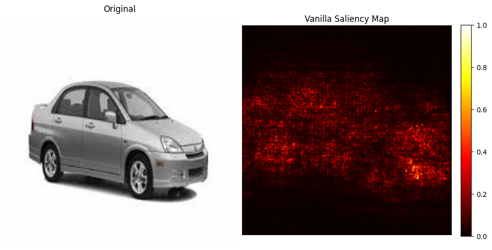
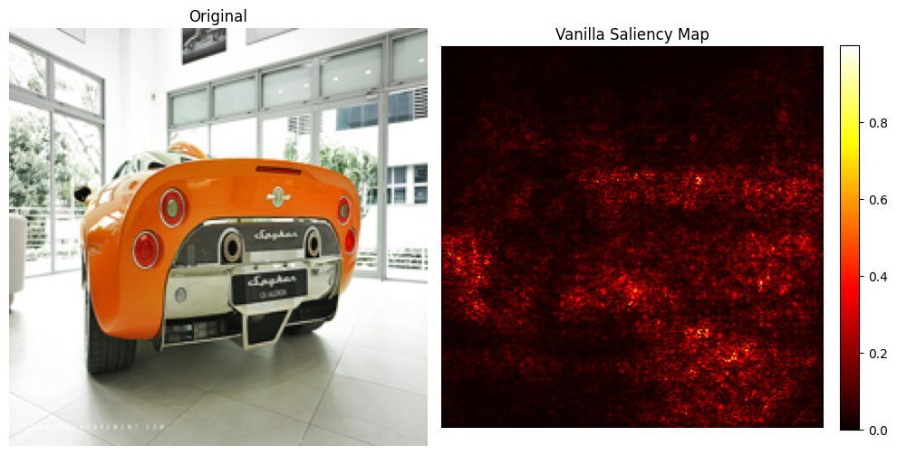
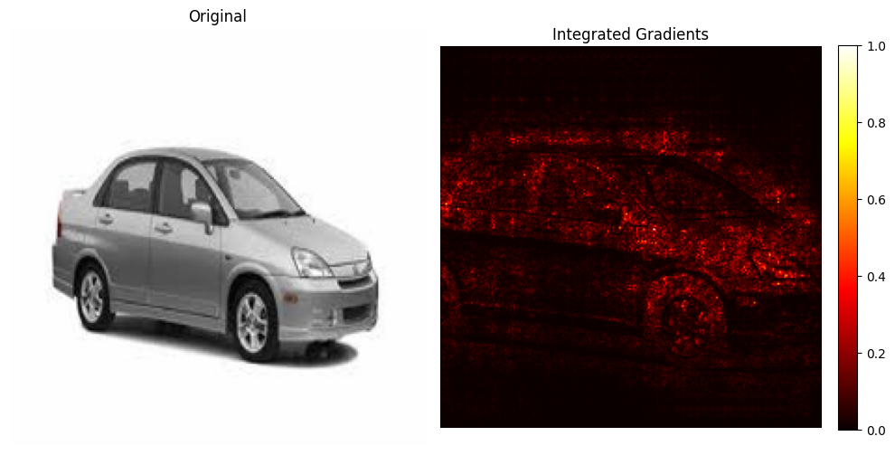
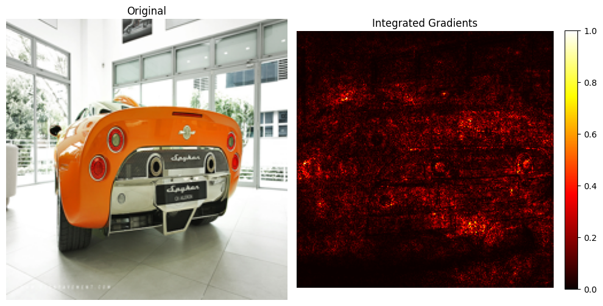
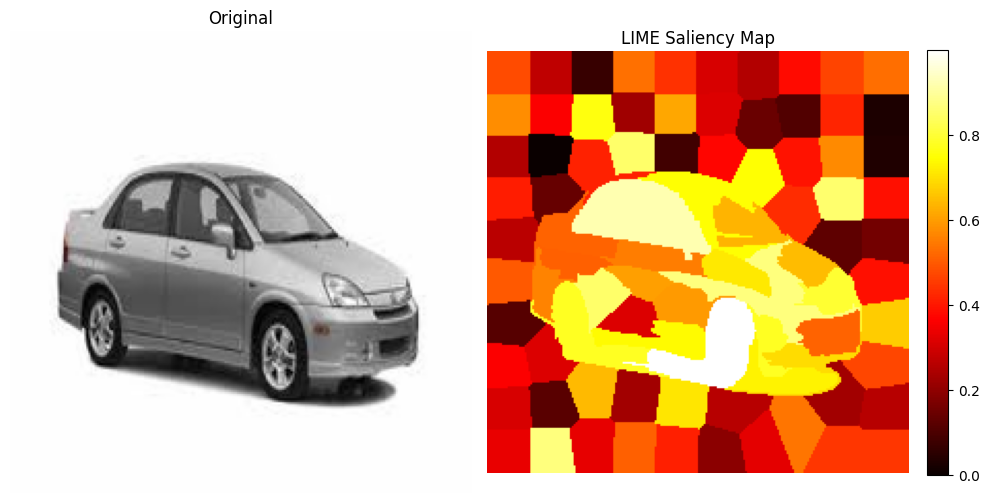
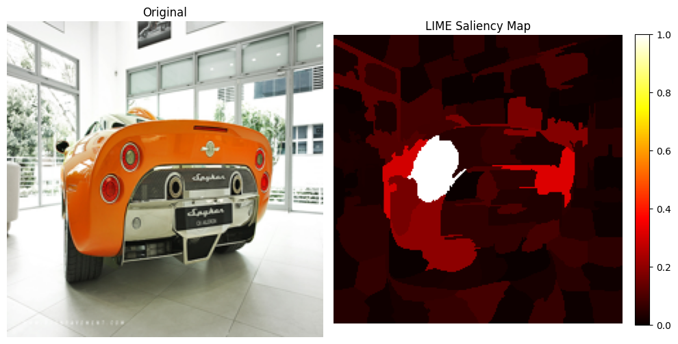

# Stanford Cars Classification & Model Explainability

This repository provides a PyTorch workflow for training and evaluating a ResNet50 classifier on the Stanford Cars dataset, together with multiple model interpretability tools for fine-grained classification analysis.

The project includes notebook-based data exploration, a training pipeline, pre-trained model weights, inference utilities, saliency and model-agnostic explanation methods, and an interactive Streamlit interface.

## Overview

The model is a ResNet50 trained on the Stanford Cars dataset with 196 classes. The repository supports training, evaluation, inference, and explainability analysis.

### Key Components

- ResNet50 architecture trained on Stanford Cars (196 classes)
- `exploreData.ipynb` for dataset inspection and visualization
- `train_stanford_cars.ipynb` and `train_stanford_cars.py` for model training
- `infer.ipynb` and `infer_saliency.py` for inference and explanation generation
- Multiple explanation methods implemented in `saliencyDefs.py`
- Interactive visualization through `streamlit_app.py`
- Pre-trained checkpoint at `outputs/best_resnet50_stanford_cars.pt`

## Explainability Methods

The framework includes complementary gradient-based saliency methods as well as model-agnostic techniques.

| Method | Description | Characteristics |
| --- | --- | --- |
| **Vanilla Saliency** | Computes input gradients with respect to the predicted class score and visualizes pixel-level sensitivity. | Fast; input-space; raw gradient magnitudes |
| **Grad-CAM** | Uses class-weighted activations from intermediate convolutional layers to localize important spatial regions. | Interpretable spatial regions; layer-specific; preserves spatial structure |
| **Guided Backprop** | Combines vanilla gradients with positive activation masking at ReLU layers during backpropagation. | High-resolution; reduced noise; preserves fine-grained details |
| **Integrated Gradients** | Accumulates gradients along a linear interpolation path from a baseline to the input. | Axiomatically motivated; robust to saturation; requires a baseline |
| **LIME** | Fits a local interpretable surrogate model to perturbed versions of an input. | Model-agnostic; coarse, superpixel-based explanations |
| **SHAP** | Uses Shapley-based additive feature attribution. | Model-agnostic feature attribution |

## Inference Workflow

The inference notebook loads the ResNet50 checkpoint, applies the same ImageNet-style preprocessing used during training, predicts a class for a sample Stanford Cars image, and generates explanation maps.

Key steps in `infer.ipynb`:

1. Load the model checkpoint from `outputs/best_resnet50_stanford_cars.pt`.
2. Read the Stanford Cars class metadata from `archive/cars_meta.mat`.
3. Preprocess a test image with resize, center crop, tensor conversion, and normalization.
4. Run inference to obtain the predicted class and confidence.
5. Compute and visualize explanation maps such as vanilla saliency, integrated gradients, and LIME.

## Results

The figures below are stored in the `figures/` folder and show two different cars for each explanation method.

### Vanilla Saliency

Vanilla saliency measures how much a small change in each input pixel would change the model's output, producing a pixel-level importance map.

| Car 1 | Car 2 |
| --- | --- |
|  |  |

#### Limitations

1. **Noisy and hard to interpret** — Raw gradients often produce high-frequency maps that do not align cleanly with human-interpretable features.
2. **Sensitive to model saturation** — Gradients can vanish in saturated regions, potentially producing misleading attribution maps. Integrated gradients can help address this issue.
3. **Not robust to small perturbations** — Small input changes can substantially alter the gradient map.
4. **May highlight edges instead of semantics** — Gradients often emphasize edges or textures rather than meaningful object parts.
5. **Poor localization** — Vanilla gradients can struggle to clearly identify the regions that drive a prediction in complex scenes.

Possible alternatives include:

- **Guided Backpropagation** to filter gradients and produce cleaner high-resolution visualizations.
- **SmoothGrad** to average gradients over noisy inputs and reduce visual noise.
- **Integrated Gradients** to improve behavior in saturated regions.

### Integrated Gradients

Integrated gradients accumulates gradients from a baseline input to the actual image, producing a more continuous attribution map and helping address saturation problems found in raw gradients.

| Car 1 | Car 2 |
| --- | --- |
|  |  |

### LIME

LIME explains a single prediction from a black-box model by:

1. Creating perturbed versions of the input image.
2. Getting the model's predictions for each perturbed sample.
3. Weighting samples based on similarity to the original input.
4. Fitting a simple, interpretable surrogate model, usually linear.
5. Using the surrogate to identify which image regions influenced the prediction.

| Car 1 | Car 2 |
| --- | --- |
|  |  |

#### Limitations

1. **Hyperparameter sensitivity** — Changes such as the number of superpixels can produce inconsistent explanations.
2. **Out-of-distribution perturbations** — Masking superpixels can create unrealistic images and unpredictable model behavior.
3. **Local linearity assumption** — A linear surrogate may poorly approximate the behavior of a highly nonlinear vision model.
4. **Instability** — Re-running LIME can produce different explanations because segmentation and sampling involve randomness.

## Discussion

Across both example cars, the explanation methods mostly focus on the vehicle rather than the background, suggesting that the classifier is learning from the car itself rather than primarily from the surrounding scene.

Integrated gradients gives the most continuous attribution and generally traces the body, windows, and wheel areas more cleanly. Vanilla saliency is noisier and more pixel-level, making it useful as a quick sensitivity signal but less stable as an explanation. LIME produces larger block-like regions that are easy to read at a glance, although its superpixel boundaries make the explanations coarser than gradient-based methods.

Overall, the methods are consistent at a high level but differ in granularity: vanilla saliency is the noisiest, integrated gradients is the smoothest, and LIME is the most segmented.

## Environment Setup

### Prerequisites

- Python 3.8 or higher
- CUDA-capable GPU recommended (CUDA 11.8+)

### Installation

1. Clone the repository and navigate to the project directory:

   ```bash
   cd StanfordCarDataset
   ```

2. Create and activate a virtual environment:

   ```bash
   python -m venv .venv
   source .venv/bin/activate
   ```

   On Windows:

   ```bash
   .venv\Scripts\activate
   ```

3. Install dependencies:

   ```bash
   pip install -r requirements.txt
   ```

The `requirements.txt` file includes packages needed for model training, inference, explainability analysis, LIME, SHAP, and the Streamlit visualization interface.

## Repository Structure

```text
├── streamlit_app.py                    # Interactive visualization interface
├── saliencyDefs.py                     # Core explainability implementations
├── train_stanford_cars.py              # Training pipeline (CLI)
├── train_stanford_cars.ipynb           # Training pipeline (notebook)
├── exploreData.ipynb                    # Dataset exploration and analysis
├── infer_saliency.py                    # Inference and explanation generation
├── infer.ipynb                          # Inference notebook
├── utils.py                             # Utility functions
├── figures/                             # Explanation figures used in this README
├── outputs/
│   ├── best_resnet50_stanford_cars.pt  # Pre-trained model checkpoint
│   └── saliency/                        # Generated explanation visualizations
└── archive/                             # Dataset annotations and training splits
```

## Usage

### Interactive Model Exploration

Launch the Streamlit application:

```bash
streamlit run streamlit_app.py
```

The interface supports:

- Image upload and inference
- Real-time saliency map generation
- Selection between multiple explanation techniques
- Visualization and export of results

### Model Training and Evaluation

Run the command-line training pipeline:

```bash
python train_stanford_cars.py
```

Or use the notebook:

```bash
jupyter notebook train_stanford_cars.ipynb
```

### Dataset Exploration

```bash
jupyter notebook exploreData.ipynb
```

### Inference and Explainability

Open the inference notebook:

```bash
jupyter notebook infer.ipynb
```

Use `outputs/best_resnet50_stanford_cars.pt` to run inference without retraining the model.

## Pre-trained Model

A trained ResNet50 checkpoint is provided at:

```text
outputs/best_resnet50_stanford_cars.pt
```

It is ready for inference without additional training.

## Quick Start

1. Install the dependencies from `requirements.txt`.
2. Open `exploreData.ipynb` to inspect the dataset and sample images.
3. Use `train_stanford_cars.ipynb` or `train_stanford_cars.py` to train or evaluate the classifier.
4. Open `infer.ipynb` to run predictions and explanation analysis.
5. Launch `streamlit_app.py` for interactive model exploration.
